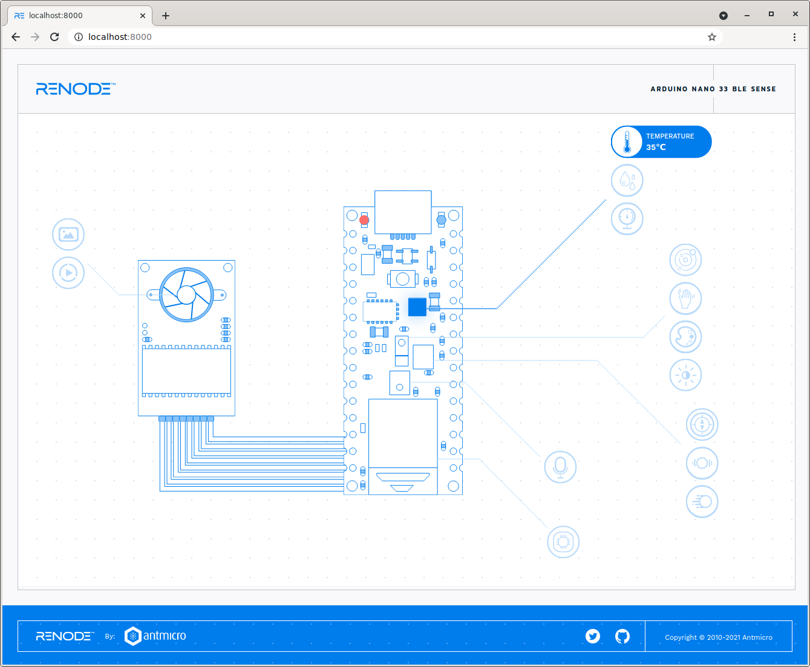
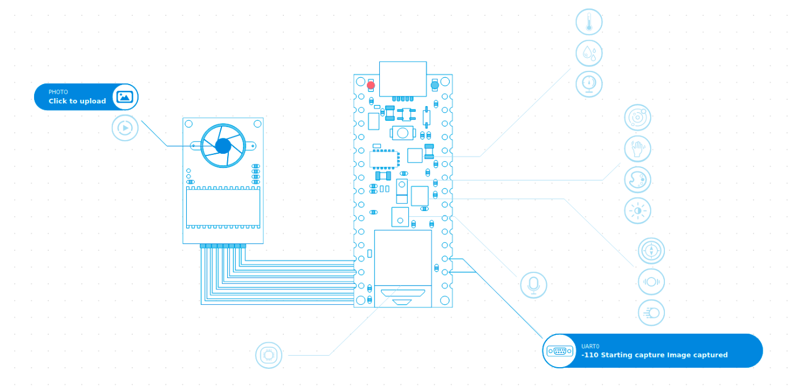

# Renode interactive visualization example

Copyright (c) 2021 [Antmicro](https://www.antmicro.com)

Interactive visualization of an emulated board, to be used with the [Renode Framework](https://www.renode.io).

At the moment the visualisation focuses on Arduino Nano 33 BLE Sense, with Nordic's nRF52840.

This repository is best used with Renode 1.12 or newer.

## Installation

To run this visualisation you need Renode 1.12 installed in the host operating system (see the [documentation](https://docs.renode.io/en/latest/introduction/installing.html) for details).

For Linux, you can use the portable version:
```
wget https://github.com/renode/renode/releases/download/v1.12.0/renode-1.12.0.linux-portable.tar.gz
mkdir renode_portable
tar xf renode-1.12.0.linux-portable.tar.gz -C renode_portable --strip-components=1
export PATH="`pwd`/renode_portable:$PATH"
```

## Usage

### Blinky

To open the interactive visualisation in your browser, run:

```
renode scripts/blinky.resc
# in Renode:
(machine-0) serveVisualization 8000
```

Then point your browser to [localhost:8000](http://localhost:8000):

```
xdg-open localhost:8000
```

You should be able to see the Arduino Nano wireframe with a blinking LED and some interactive elements.



### Person detection

Another available demo is the [TensorFlow Lite Micro person detection](https://github.com/tensorflow/tensorflow/tree/master/tensorflow/lite/micro/examples/person_detection).
To start it, run:

```
renode scripts/person_detection.resc
# in Renode:
(machine-0) serveVisualization 8000
```

Then open [localhost:8000](http://localhost:8000) in your browser:

```
xdg-open localhost:8000
```

You will see a similar wireframe, but you will be able to observe the detection results in the UART bubble in the bottom right part of the page.

Click on the photo bubble (top left part of the page) to upload your image as a source file for the person detection demo.
The image has to be a JPEG smaller than 4kB.
You can use a [provided sample image](./assets/person_detection_default.jpg).



## Testing

To run an automatic test with a screen grabber, run

```
cd tests
./test.py
```

See the result in the `*.webm` file.

For additional requirements for running the test script, see [.ci.yml](./.ci.yml) file.

